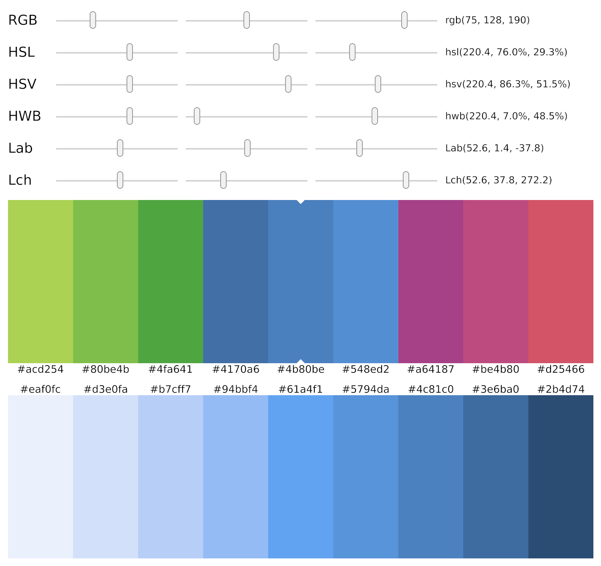

## Color palette

A color palette generator, based on a user-defined root color.

<div align="center">
  
</div>

These sources are a read-only copy. To run it, clone the upstream workspace at the release (`git clone --branch 0.14.0 https://github.com/iced-rs/iced`) and, from its root:

```
cargo run --package color_palette
```
