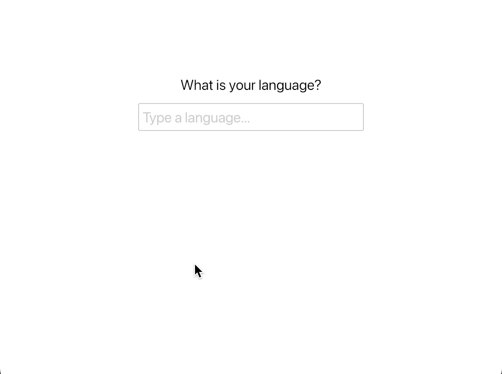

## Combo-Box

A dropdown list of searchable and selectable options.

It displays and positions an overlay based on the window position of the widget.

The __[`main`]__ file contains all the code of the example.

<div align="center">
    
</div>

These sources are a read-only copy. To run it, clone the upstream workspace at the release (`git clone --branch 0.14.0 https://github.com/iced-rs/iced`) and, from its root:
```
cargo run --package combo_box
```

[`main`]: src/main.rs
