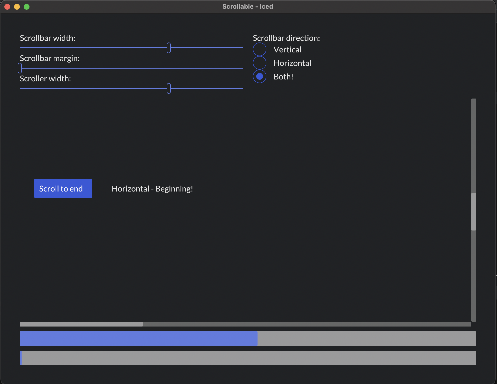

# Scrollable
An example showcasing the various size and style options for the Scrollable.

All the example code is located in the __[`main`](src/main.rs)__ file.

<div align="center">
  <a href="screenshot.png">
    
  </a>
</div>

These sources are a read-only copy. To run it, clone the upstream workspace at the release (`git clone --branch 0.14.0 https://github.com/iced-rs/iced`) and, from its root:
```
cargo run --package scrollable
```
