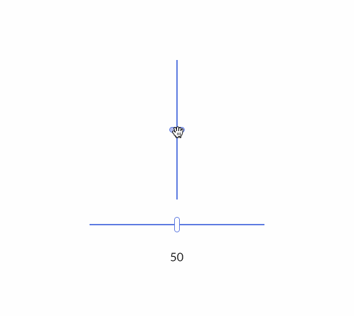

## Slider

A `Slider` is a bar and a handle that selects a single value from a range of values.
There exists both `Slider` and `VerticalSlider` depending on which orientation you need.

<div align="center">
    
</div>

These sources are a read-only copy. To run it, clone the upstream workspace at the release (`git clone --branch 0.14.0 https://github.com/iced-rs/iced`) and, from its root:

```
cargo run --package slider
```
