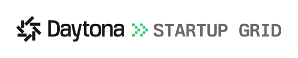
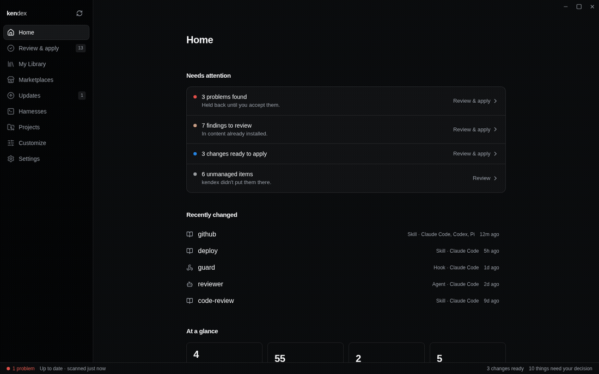

# kendex <a href="https://daytona.io" target="_blank" rel="noopener"><picture><source media="(prefers-color-scheme: dark)" srcset="docs/images/daytona-startup-grid-dark-transparent.svg"></picture></a>

kendex is a desktop app and command-line tool for people who use AI coding tools such as Claude Code, Codex and Cursor. It manages agents, skills, hooks and other customizations: you set them up once and use them across your tools and projects.

<p>       </p>



## Features

- Installs customizations across your coding tools from one setup.
- Converts agent and skill files into the format each tool reads.
- Previews a package change before it applies it.
- Keeps a personal setup and a separate setup for each project.
- Adopts customizations you set up by hand with `kendex adopt <kind> <name>`. For a project skill, the real directory moves to `.agents/skills/<name>`. With symlink delivery, separate coding-tool positions become kendex-managed links, including links you made by hand. With copy delivery, they become copies.
- Browses the [community marketplace](https://kendex.ai) and any package repository you subscribe to.
- Opens a marketplace or a package in the app from a `kendex://` link on a kendex.ai page.
- Finds outdated packages and updates them.
- Adds your own instructions to an agent or a skill, and gives one agent different settings in each tool.
- Enables, disables or removes an installed customization, and shows where it came from.
- Checks each package for unsafe commands and reports what it found.

## Install

```sh
curl -fsSL https://kendex.ai/install.sh | sh
```

```sh
brew install vanillagreencom/kendex/kendex
```

```sh
yay -S kendex-bin
```

Windows: the installer at [kendex.ai/download](https://kendex.ai/download). The script installs the app and the CLI on Linux, and the CLI on macOS, where Homebrew installs the app. The other channels are in [packaging](packaging/README.md).

## Supported tools

| | Claude Code | Codex | OpenCode | Cursor | Pi | Gemini CLI | GitHub Copilot | Antigravity |
|---|:-:|:-:|:-:|:-:|:-:|:-:|:-:|:-:|
| Agents | ● | ● | ● | ●¹ | ● | ● | ● | ●² |
| Skills | ● | ● | ● | ●¹ | ● | ● | ● | ● |
| Hooks | ● | ● | ●³ | ●¹ ³ | ●⁴ | ● | ● | ● |
| Commands | ● | ●⁵ | ● | ○⁶ | ● | ● | -⁷ | - |
| MCP servers | ● | ● | ● | ● | - | ●⁸ | ●⁹ | ● |
| Plugins | ◐ | ○ | ○ | ○ | - | ○ | ◐ | ○ |
| Pi extensions | - | - | - | - | ● | - | - | - |

● managed · ◐ enable and disable · ○ shown read-only · - not supported.

1. Cursor is managed in projects only.
2. Antigravity reads agents from its own global directory alone, so an agent installs there and never in a project.
3. OpenCode has no hook runtime and Cursor takes a rule rather than a registration, so a hook on either is instructions the model may ignore; a `PreToolUse` hook on `Bash` also sets OpenCode's `permission.bash` to ask.
4. Pi runs hooks through the `pi-hooks` extension; without it registered they are only instructions.
5. Codex stores a command as a skill.
6. Cursor has deprecated slash commands in favour of skills, so a command there is shown and never written.
7. Copilot CLI reads no command directory of its own; the one it does read is Claude Code's.
8. Gemini records whether an MCP server is on in one machine-wide file, so a project can declare a server but not switch it off there.
9. Copilot also lists its built-in MCP servers and controls them through native settings. A project's enable cannot override a personal disable.

The full per-tool facts are in [docs/adapters](docs/adapters/README.md).

## How it works

You list what you want in a `kendex.toml` file: one for your personal setup, and one inside any project that needs its own. kendex reads the customizations already sitting in each coding tool's folders, compares them with your list, and shows you the difference. When you apply, it writes the files each tool reads and records what it installed, and where each package came from, so it can update or remove it later. The desktop app and the CLI read and write the same setup, so a change made in one shows up in the other. Delete a package from your list and the next apply removes its files, except ones you edited by hand and Pi extensions, which kendex keeps and reports.

## Packages

This repository is also the default catalog. Its agents, skills, hooks and Pi extensions are listed on the [default catalog](https://kendex.ai/m/vanillagreencom/kendex) page; each Pi extension is also on npm under `@vanillagreen/`.

| Package | What it is |
|---|---|
| [agents/](agents/) | Implementation, review and planning agents for coding harnesses. |
| [skills/](skills/) | Workflow and guard skills: orchestration, review, commit guards, docs writing and more. |
| [hooks/](hooks/README.md) | Hook scripts that run at a harness's events. |
| [pi-extensions/](pi-extensions/) | Pi extensions: hooks, session tools, background tasks and more. |

## Setup

- `kendex.toml` declares a setup and holds the instructions or options you add for each tool.
- Package settings apply per project; change them in the package's Customize tab or in that project's `kendex.settings.toml`.
- Private settings and secrets go in `.env.local`.
- A formatter such as Biome or Prettier that checks JSON at the project root needs `.kendex-lock.json` and `.kendex-generated.json` in its ignore list; kendex writes both in its own layout.

Writing a package of your own: [docs/authoring](docs/authoring/README.md). Working on kendex itself: [DEVELOPMENT.md](DEVELOPMENT.md).

## Licence

[MIT](LICENSE)
